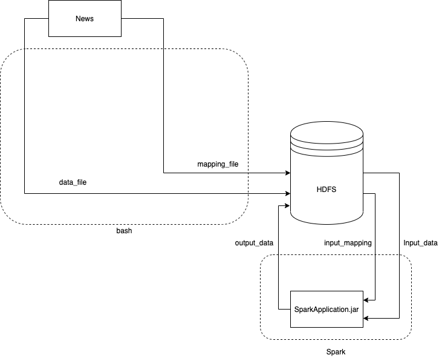

# Description  
Spark application to aggregate news feed logs and bash script to transfer data to HDFS

# Required tools  
- JDK (version 8 or later)
- git
- maven
- docker
- python3

# Build application and start container
```
cd scripts
./run_docker.sh
```
run_docker.sh will compile jar with dependencies, start hadoop cluster and put compiled jar to the container 
NameNode UI will be available at http://localhost:50070 

# Running the application
Run the following command to:
- restart hdfs
- create required dirs in HDFS
- generate new data using python3
- import data to HDFS
- print the head of the result

# Components diagram


# Screenshots
Screenshots are available [here](./screenshots/README.md)