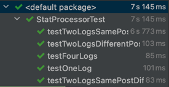
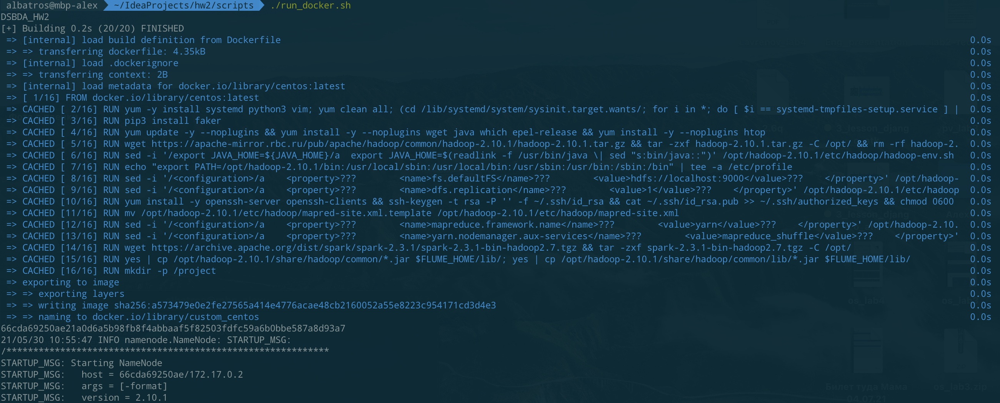
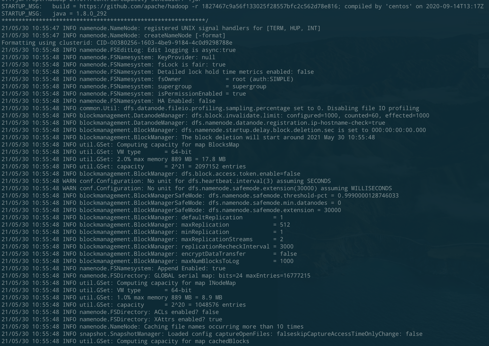
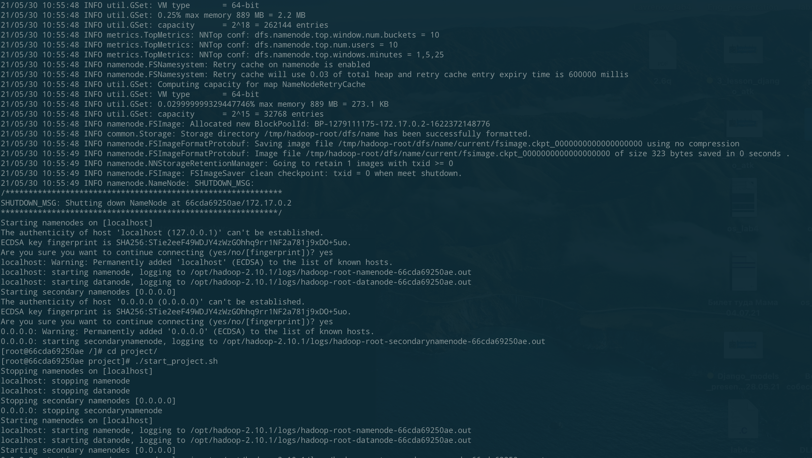
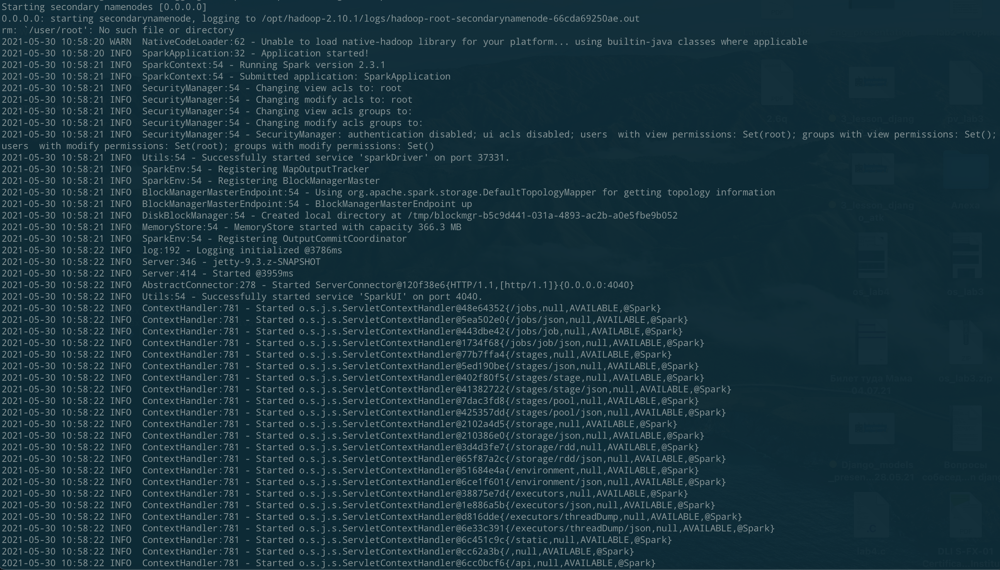
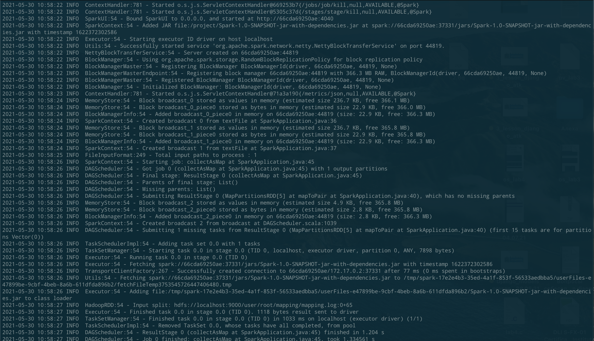
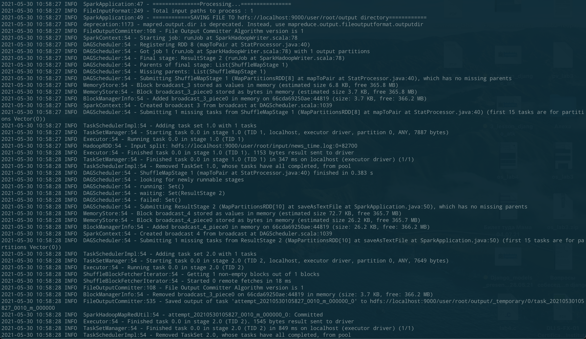
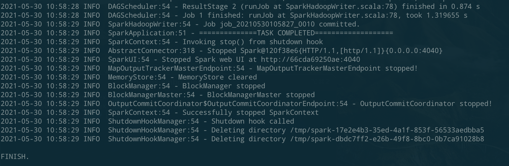
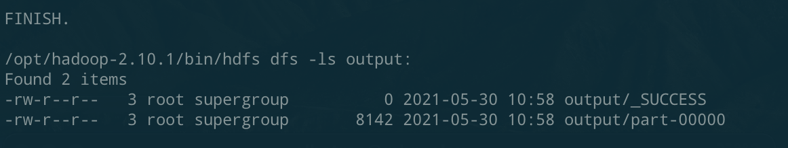
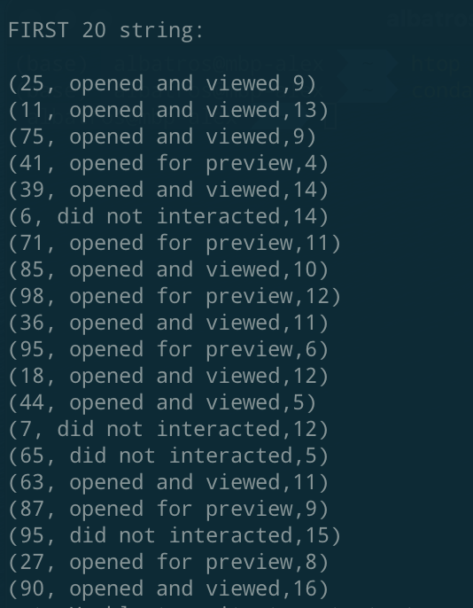

# This README contains screenshots of passed tests, launched task and listing of input and output files

### Spark tests

### Generating data, importing to HDFS and running Spark application logs

### Listing of output files

### Part of result
